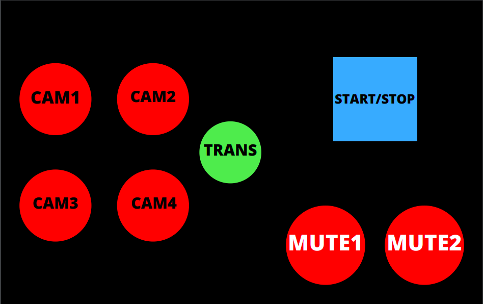

Project Description: 
----
* A simple Stream Deck based on blackmagic's design. Made with a lolin32 microcontroller emulating a keyboard. 

Design:
----

Desing Description:
----
*   `CAM1` = Set scene1 to preview; 
*   `CAM2` = Set scene2 to preview;
*   `CAM3` = Set scene3 to preview;
*   `CAM4` = Set scene4 to preview;

*   `TRANS` = Apply de default transition 

*   `MUTE1` = Mute one sound channel
*   `MUTE2` = Mute one sound channel  

Componnents: 
----
* 8 push buttons; 
* 8 1MOhm resistors; 
* 1 Lolin32 v1.0.0; 
* 1 Universal circuit board; 
* 1 Patola box 
* additonal sockets and wires; 

Future ADDs
----
* Battery with builtin charger (lolin32); 
* Bluetooth connection 
